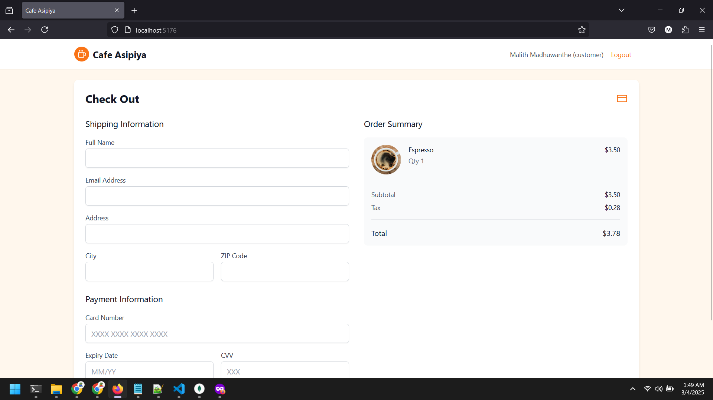
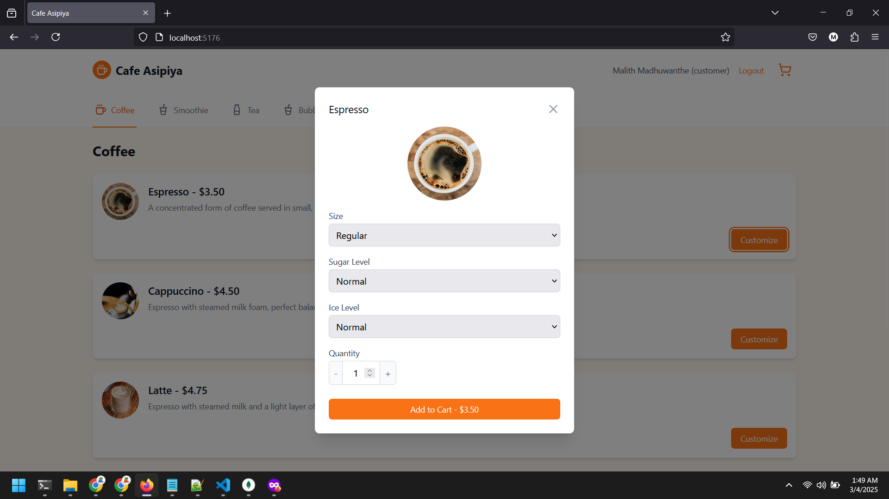
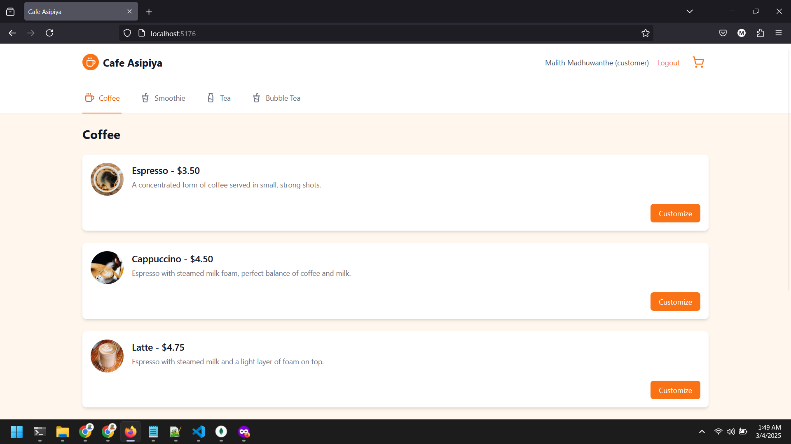
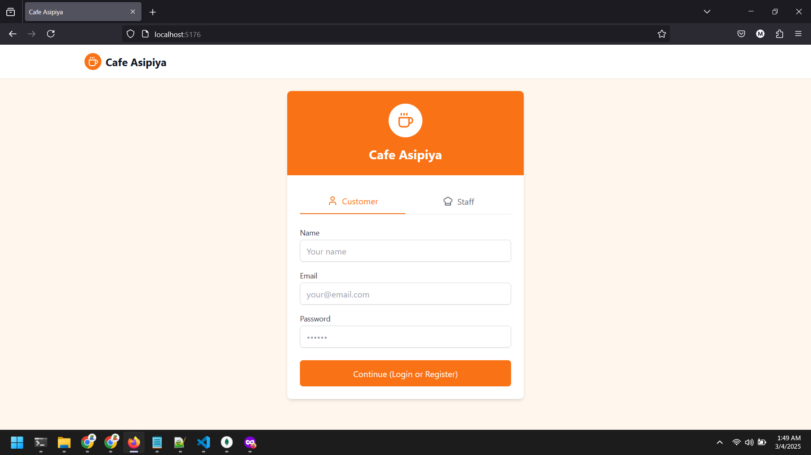

# 🍵 Cafe Asipiya

A simple cafe ordering system with customer and staff interfaces. Customers can browse menu items, customize orders, and place them, while staff can manage and update order statuses.

## 📱 Screenshots

### 👤 Customer Interface

<div style="display: flex; flex-wrap: wrap; gap: 15px; justify-content: center;">

#### 🛒 Cart


#### 💳 Checkout


#### ✨ Customize Order


#### 📋 Items List


#### 🔐 Login


</div>

### 👨‍💼 Staff Interface

<div style="display: flex; justify-content: center;">

#### 📊 Staff Dashboard


</div>

## ✨ Features

- **👤 Customer Interface**
  - 🍽️ Browse menu items by category (Coffee, Tea, Smoothie, Bubble Tea)
  - 🔧 Customize orders (size, sugar level, ice level)
  - 🛒 Shopping cart functionality
  - 💳 Order checkout
  - ⭐ Customer reviews
  - 📝 User registration and login

- **👨‍💼 Staff Interface**
  - 📋 View all orders
  - 🔄 Update order status (pending, in-progress, completed)
  - 🔍 View order details

## 🛠️ Technologies Used

- **🖥️ Frontend**: React, TypeScript, Tailwind CSS
- **⚙️ Backend**: Node.js, Express
- **💾 Database**: MongoDB
- **🔒 Authentication**: JWT

## 🚀 How to Run

1. Make sure you have Node.js and MongoDB installed on your computer
2. Clone the repository
   ```
   git clone https://github.com/malithonline/Beverage-system.git
   cd Beverage-system
   ```
3. Install dependencies
   ```
   npm install
   ```
4. Set up environment variables
   - Create a `.env` file in the root directory with the following:
   ```
   MONGODB_URI=mongodb://localhost:27017/cafeAsipiya
   JWT_SECRET=cafe_asipiya_secret_key_2025
   PORT=5000
   ```
5. Seed the database with sample data
   ```
   npm run seed
   ```
6. Start the application
   ```
   npm run dev
   ```
7. Open your browser and go to `http://localhost:5173`

## 🔑 Login Credentials

### 👨‍💼 Staff Login
- Email: staff@cafe.com
- Password: staff123

### 👤 Customer Login
- Email: malith@cafe.com, pasindu@cafe.com, or kavindu@cafe.com
- Password: 123456

## 📁 Project Structure

- `/frontend` - React frontend application
- `/backend` - Node.js backend API
- `/backend/models` - MongoDB models
- `/backend/controllers` - API controllers
- `/backend/routes` - API routes

## ⚙️ How It Works

1. **📦 Orders**: When a customer places an order, it's saved to MongoDB through the backend API. The order includes customer details, product information, customizations, and status.
2. **🔒 Authentication**: Users can register and login. JWT tokens are used for authentication.
3. **📊 Staff Dashboard**: Staff members can view all orders and update their status. The changes are saved to the database.
